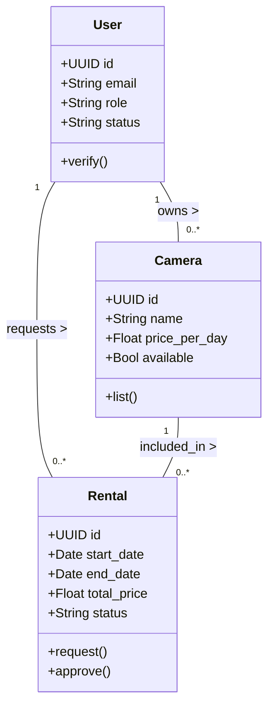
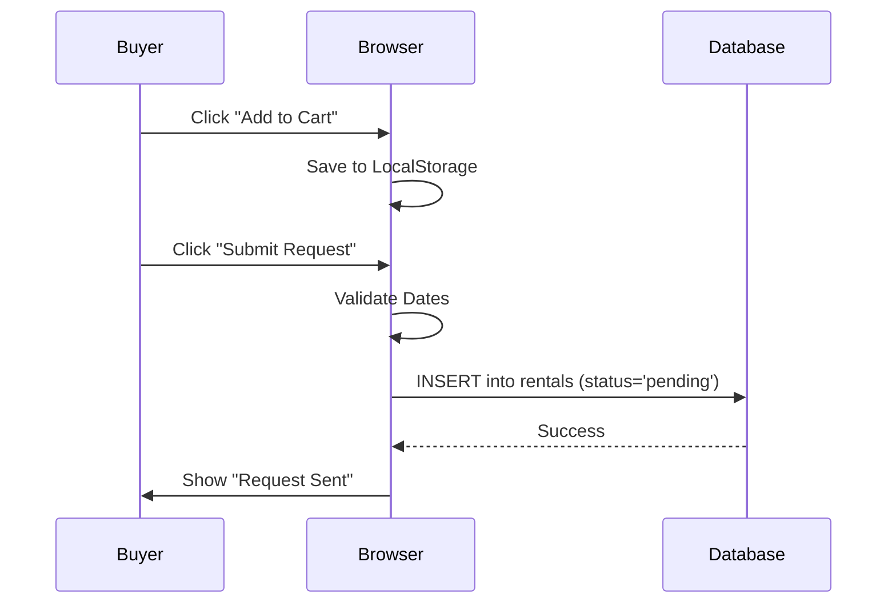

# Semester Project: Developing a Functional Software Application
**Project Title:** LensLocker - Peer-to-Peer Camera Rental System

---

## Phase 1: Project Proposal

### 1. Project Title & Description
**Title:** LensLocker
**Description:** LensLocker is a web-based marketplace designed to connect photographers and videographers. It allows individuals to rent out their idle camera equipment to others in need of high-quality gear for short-term projects. The platform acts as a secure intermediary, handling equipment listing, user verification, and rental requests.

### 2. Problem Statement
High-end photography and cinematography equipment is prohibitively expensive for students, hobbyists, and early-career professionals. Conversely, many equipment owners (sellers) have gear that sits unused for long periods, generating no value. There is currently a lack of a trusted, centralized platform in the local market to facilitate secure rentals between these two groups, leading to reliance on unverified social media groups which lack security and structure.

### 3. Proposed Solution
We propose a "Camera Rental System" web application. usage:
*   **For Renters (Buyers):** Easy access to a wide variety of cameras and lenses at affordable daily rates.
*   **For Owners (Sellers):** A way to monetize idle assets with a verified user base.
*   **For Safety:** A verification system requiring CNIC uploads to ensure accountability.

### 4. Technology Stack
*   **Frontend:** HTML5, CSS3 (Custom Glassmorphism UI), JavaScript (Vanilla ES6+).
*   **Backend & Database:** Supabase (PostgreSQL, Authentication, Storage).
*   **Tools:** Visual Studio Code, Git/GitHub.

### 5. Team Roles
*   **Frontend Developer:** Responsible for the UI/UX, responsiveness (Mobile/Desktop), and interaction logic using JS.
*   **Backend Developer:** Responsible for Database schema design, Supabase integration, and security policies (RLS).
*   **QA/Tester:** Responsible for verifying user flows (Sign up, Listing, Renting) and ensuring specific requirements (e.g., currency display) are met.

---

## Phase 2: Requirements Gathering & SRS

### 1. Functional Requirements (Detailed Use Cases)

#### UC-01: User Registration & Verification
**Actor:** Guest User
**Description:** A user creates an account to become a Buyer or Seller.
**Pre-condition:** User is not logged in.
**Steps:**
1.  User clicks "Sign Up".
2.  User enters Email and Password.
3.  User selects Role (Buyer/Seller).
4.  User uploads CNIC Front, Back, and Selfie images.
5.  System saves data with status "Pending".
6.  Admin reviews and approves account.
**Post-condition:** User has a registered account awaiting approval.

#### UC-02: Post Camera Listing
**Actor:** Seller (Approved)
**Description:** Seller lists a camera for rent.
**Pre-condition:** Seller is logged in and approved.
**Steps:**
1.  Seller navigates to Dashboard -> Listings.
2.  Seller clicks "List New Camera".
3.  Seller inputs Model Name, Description, and Price per Day.
4.  Seller uploads Cover Photo and optional Gallery Photos.
5.  System uploads images to secure storage and creates DB record.
**Post-condition:** Camera appears in the Marketplace.

#### UC-03: Rent Camera (Add to Cart & Checkout)
**Actor:** Buyer (Approved)
**Description:** Buyer selects cameras and requests a rental.
**Steps:**
1.  Buyer browses Marketplace.
2.  Buyer clicks "Add to Cart" on desired items.
3.  Buyer goes to "My Cart" and selects Start/End dates.
4.  Buyer clicks "Submit Request".
5.  System calculates total price and creates "Pending" rental records.
**Post-condition:** Request is sent to Seller.

#### UC-04: Manage Rental Requests
**Actor:** Seller
**Steps:**
1.  Seller receives notification (on dashboard) of new request.
2.  Seller views Buyer details and requested dates.
3.  Seller clicks "Approve" or "Reject".
4.  System updates rental status and notifies Buyer via dashboard.

### 2. Non-Functional Requirements
*   **Performance:** The application dashboard should load within 2 seconds. Images should use lazy loading or be served via CDN.
*   **Security:**
    *   **Data Protection:** CNIC images must NEVER be publicly accessible. They are served only via time-limited Signed URLs.
    *   **Access Control:** Row Level Security (RLS) policies enforce that only the owner can edit their listings.
*   **Reliability:** The system depends on Supabase reaching 99.9% uptime.
*   **Usability:** The interface uses a "Dark Mode Glassmorphism" theme to appeal to creative professionals and is fully responsive for mobile usage.

### 3. Assumptions and Dependencies
*   **Internet:** Users must have a stable internet connection.
*   **Browser:** Users are using a modern browser (Chrome/Edge/Firefox) supporting ES6+ JavaScript.
*   **Third-Party:** The system relies entirely on Supabase for backend services.

### 4. Domain Model Diagram



---

## Phase 3: System Design

### 1. Architectural Design
The application utilizes a **Serverless / BaaS (Backend as a Service)** architecture. The frontend is a static SPA (Single Page Application) hosted on any web server (or locally), which communicates directly with the Supabase cloud cluster via client-side libraries.

```mermaid
graph TD
    Client[Web Browser (HTML/JS)]
    CDN[Supabase Storage CDN]
    Auth[Supabase Auth Service]
    DB[(PostgreSQL Database)]

    Client -->|HTTPS / JSON| Auth
    Client -->|HTTPS / REST| DB
    Client -->|HTTPS / Image Assets| CDN
    Auth -->|JWT Token| Client
    Client --o|Token (RLS)| DB
```

### 2. Class & Sequence Diagrams

#### Sequence Diagram: Rental Request Flow



### 3. Database Schema Design (ERD)

**Table: `profiles`**
*   `id`: UUID (PK)
*   `role`: 'buyer' | 'seller' | 'admin'
*   `cnic_*`: Secure image paths
*   `status`: 'pending' | 'approved'

**Table: `cameras`**
*   `id`: UUID (PK)
*   `owner_id`: UUID (FK -> profiles.id)
*   `price_per_day`: Numeric

**Table: `rentals`**
*   `id`: UUID (PK)
*   `camera_id`: FK -> cameras
*   `buyer_id`: FK -> profiles
*   `status`: 'pending' | 'approved' | 'rejected' | 'completed'

### 4. User Interface Mockups
*(The following describes the actual implemented UI)*

1.  **Landing Page:**
    *   **Header:** Transparent glass navbar with Logo and "Login" buttons.
    *   **Hero:** "Rent Premium Gear" typography with gradient text.
    *   **Grid:** 3-column layout highlighting featured cameras.
2.  **Buyer Dashboard:**
    *   **Sidebar:** Fixed left navigation with icons (Home, Cart, Profile).
    *   **Marketplace Grid:** Card-based layout showing Camera Photo, Name, and Price/Day.
    *   **Cart Modal:** List of selected items with a Date Picker and "Total Price" calculation.
3.  **Seller Dashboard:**
    *   **Stats Bar:** (If implemented) Income overview.
    *   **Tabbed View:** Toggle between "My Listings", "Requests" (Yellow badges), and "History" (Green badges).
    *   **Add Modal:** Form with multi-image upload preview for listing new gear.

### 5. API Design
Since we use Supabase (PostgREST), the API is auto-generated based on the schema.
*   **GET /cameras**: `select * from cameras where available = true`
*   **POST /rentals**: `insert into rentals (camera_id, buyer_id...)`
*   **RPC (Remote Procedure Calls)**: Not currently used, relying on standard CRUD.

---

## Phase 4: Implementation & Development

### 1. Implementation Status
*   **Core Framework:** Pure HTML/CSS/JS (Lightweight, no build step required).
*   **Authentication:** Fully implemented using Supabase Auth.
*   **Database:** Tables created and connected.
*   **Features Implemented (>90%):**
    *   [x] User Sign Up/Login with file uploads.
    *   [x] Profile Verification logic.
    *   [x] Camera Listing (CRUD).
    *   [x] Marketplace display.
    *   [x] Rental Request flow with Cart System.
    *   [x] Admin Dashboard Redesign.
    *   [x] Mobile Responsiveness (Sidebar & Grid).

### 2. File Structure
```
/
├── index.html          # Landing Page
├── style.css           # Global Styles & Variables
├── auth.js             # Authentication Logic
├── buyer.js            # Marketplace & Cart Logic
├── seller.js           # Seller Dashboard Logic
├── admin.js            # Admin Dashboard Logic
├── supabase-client.js  # DB Connection
└── ... (html pages)
```

---

## Phase 5: Testing & Final Presentation

### 1. Test Cases

| Test ID | Test Case | Steps | Expected Result | Status |
|---|---|---|---|---|
| TC-01 | User Sign Up | 1. Open `seller_login.html`.<br>2. Fill email/pass.<br>3. Upload 3 images.<br>4. Click Sign Up. | User created in DB with status 'pending'. | Pass |
| TC-02 | Login Restriction | 1. Attempt login with 'pending' account. | Error message: "Your account is PENDING APPROVAL". | Pass |
| TC-03 | Create Listing | 1. Login as Seller.<br>2. Click "Add New Item".<br>3. Fill details & Submit. | Item appears in "My Listings" and Buyer Marketplace. | Pass |
| TC-04 | Rental Cart | 1. Buyer clicks "Add to Cart".<br>2. Selects dates.<br>3. Submits. | Request appears in Seller's "Requests" tab. | Pass |
| TC-05 | Mobile Sidebar | 1. Resize to mobile.<br>2. Click Menu Icon. | Sidebar slides in with overlay. | Pass |
| TC-06 | Admin Approve | 1. Admin logs in.<br>2. Clicks "Approve" on user. | User status changes to 'approved' and can login. | Pass |

### 2. Conclusion
The software provides a functional, secure foundation for a camera rental marketplace. It creates value by unlocking idle assets and providing affordable options for creatives. The system now supports advanced workflows like Shopping Carts and Admin Verification, making it a robust semester project deliverable.
